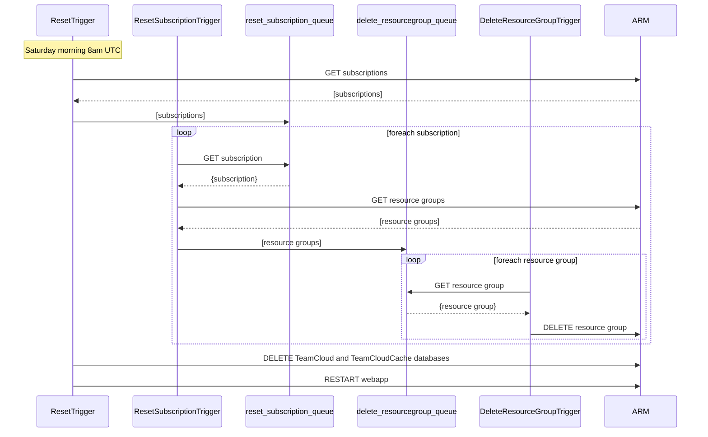
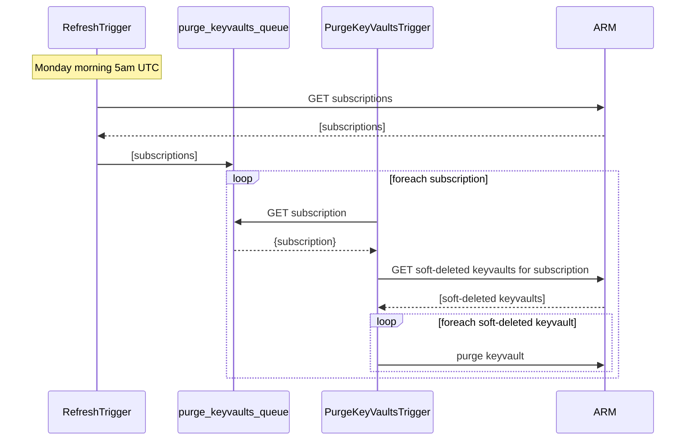

# TeamCloud Reset

A solution that resets the TeamCloud demo instance weekly.

## Functions

The solution contains the following functions, in order of execution

#### `ResetTrigger`

- Triggered every Saturday morning 8am UTC to delete all resources created by the TeamCloud demo instance
- Gets a list of Subscription objects associated with the demo instance and adds them a queue named `reset-subscription-queue`
- Deletes the `TeamCloud` and `TeamCloudCache` databases from the demo instance's Cosmos account

#### `ResetSubscriptionTrigger`

- Triggered by new messages (Subscription objects) in the queue named `reset-subscription-queue`
- Gets a list of Resource Group objects for the Subscription and adds them to a queue named `delete-resourcegroup-queue`

#### `DeleteResourceGroupTrigger`

- Triggered by new messages (Resource Group objects) in the queue named `delete-resourcegroup-queue`
- Gets all the Locks on the Resource Group and it's resources and deletes them
- Deletes the Resource Group

#### `RefreshTrigger`

- Triggered every Monday morning 5am UTC to seed the TeamCloud demo instance
- Gets a list of Subscription objects associated with the demo instance and adds them a queue named `purge-keyvaults-queue`

#### `PurgeKeyVaultsTrigger`

- Triggered by new messages (Subscription objects) in the queue named `purge-keyvaults-queue`
- Gets a list of soft-deleted KeyVaults for the Subscription and purges (permanently deletes) them

## // TODO

- Seed the demo with a few Organizations, Deployment Scopes, Project Templates, Projects?
